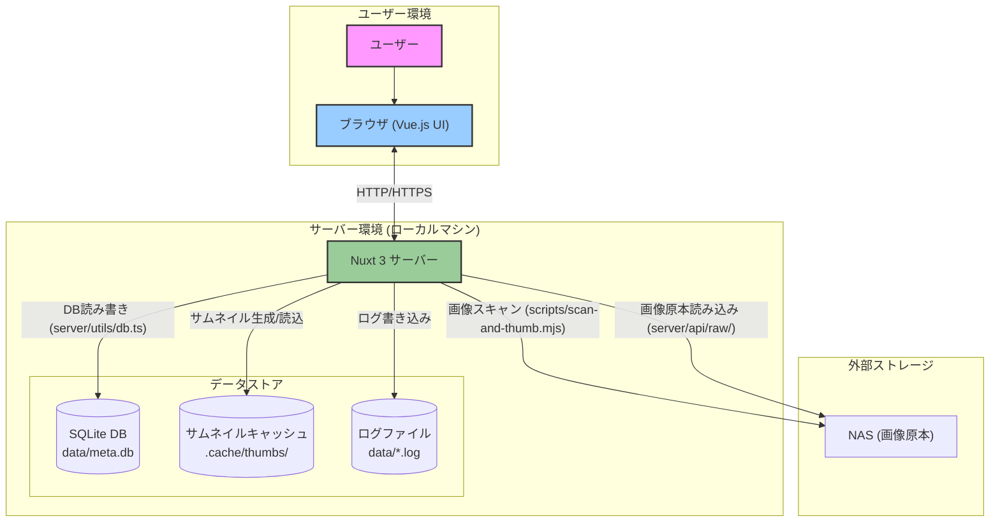
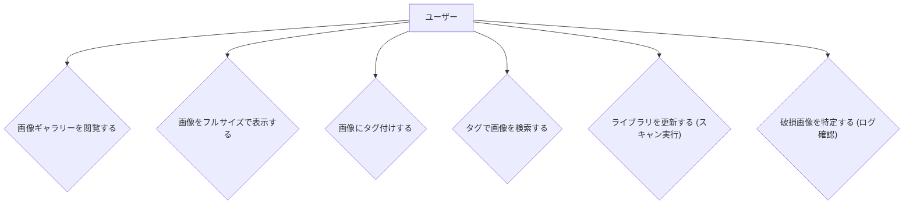
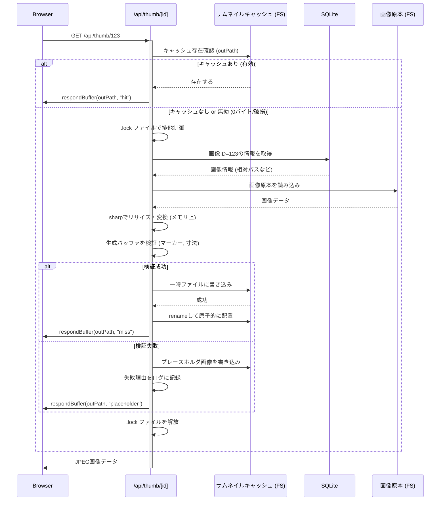

# NAS Gallery - Architecture & Design Specification

**バージョン: 1.0**
**最終更新日: 2025-08-31**

## 1. 哲学と設計思想

本アプリケーションは、個人のNAS（Network Attached Storage）に保存された膨大な写真を、安全かつ快適に閲覧・活用するための「パーソナルアーカイブ・フロントエンド」である。

設計における最優先事項は以下の通り。

1.  **データ主権 (Data Sovereignty)**: ユーザーの個人データ（写真、メタデータ）は、ユーザーが管理するローカルネットワークの外に出ることはない。
2.  **パフォーマンス (Performance)**: LAN内での動作を前提とし、画像の読み込みや操作は軽快であること。
3.  **体験価値 (User Experience)**: 単なるファイルブラウザではなく、AIなどの技術を活用して、写真との「再会」や「発見」といった価値を提供する。

この思想に基づき、アーキテクチャは「ローカルファースト」を徹底し、外部サービスへの依存を最小限に抑える。

## 2. システム構成図 (Component Diagram)

アプリケーションを構成する主要なコンポーネントと、それらの関係性を示す。

## 3. ユースケース図 (Use Case Diagram)

ユーザーがこのアプリケーションで何ができるかを示す。

## 4. 主要プロセス：サムネイル生成 (Sequence Diagram)

本アプリケーションで最も複雑なプロセスである、オンデマンドのサムネイル生成処理の流れを可視化する。

## 5. API仕様

| エンドポイント | メソッド | 説明 | パラメータ | 成功時レスポンス |
| :--- | :--- | :--- | :--- | :--- |
| `/api/images` | GET | 画像の一覧をページネーション付きで取得する。 | `page` (クエリ) | `Image[]` のJSON |
| `/api/images/[id]` | GET | 指定したIDの画像情報を取得する。 | `id` (パス) | `Image` のJSON |
| `/api/images/[id]/tags` | GET | 指定したIDの画像に付けられたタグを取得する。 | `id` (パス) | `Tag[]` のJSON |
| `/api/images/[id]/tags` | PUT | 指定したIDの画像にタグを追加/削除する。 | `id` (パス), `tags` (ボディ) | `200 OK` |
| `/api/tags` | GET | 存在するすべてのタグの一覧を取得する。 | - | `Tag[]` のJSON |
| `/api/raw/[id]` | GET | 指定したIDの画像原本をストリーミング配信する。 | `id` (パス) | `image/*` |
| `/api/thumb/[id]` | GET | 指定したIDのサムネイルを生成またはキャッシュから配信する。 | `id` (パス), `debug` (クエリ) | `image/jpeg` |
